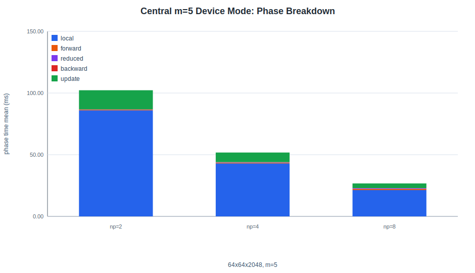
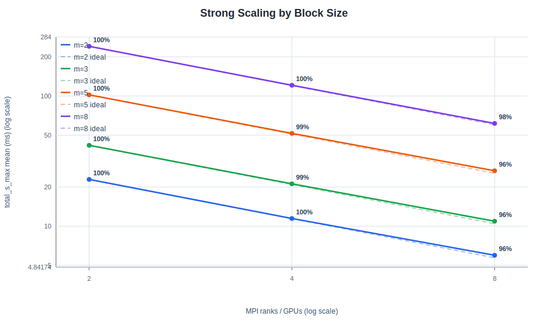
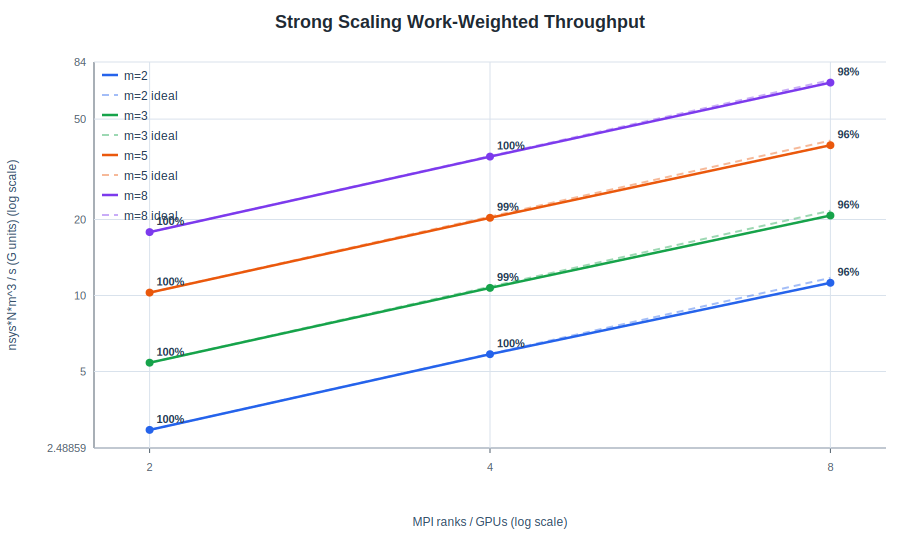
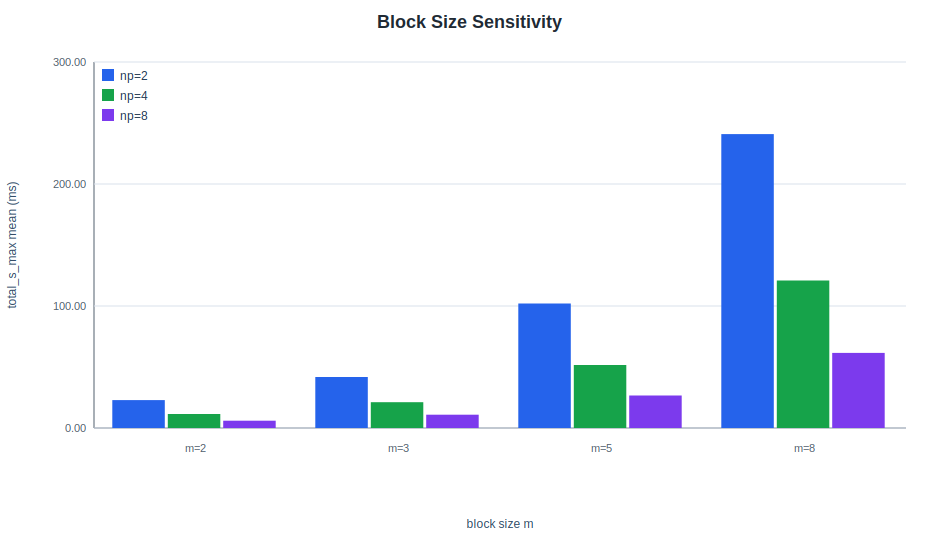
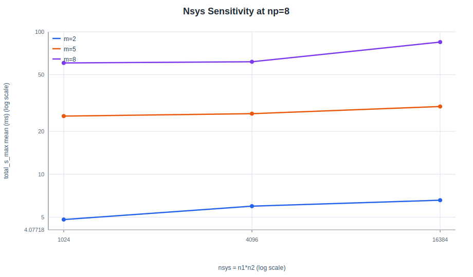
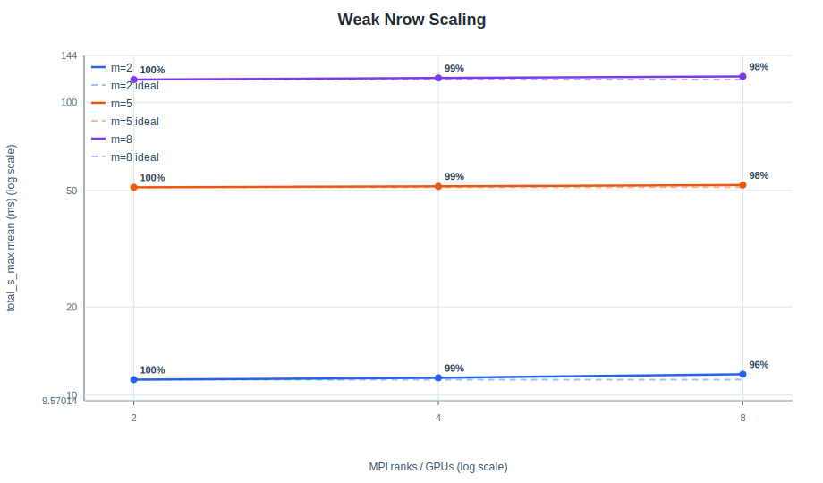
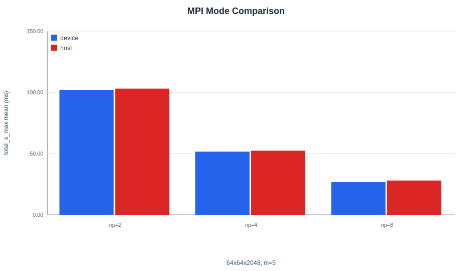
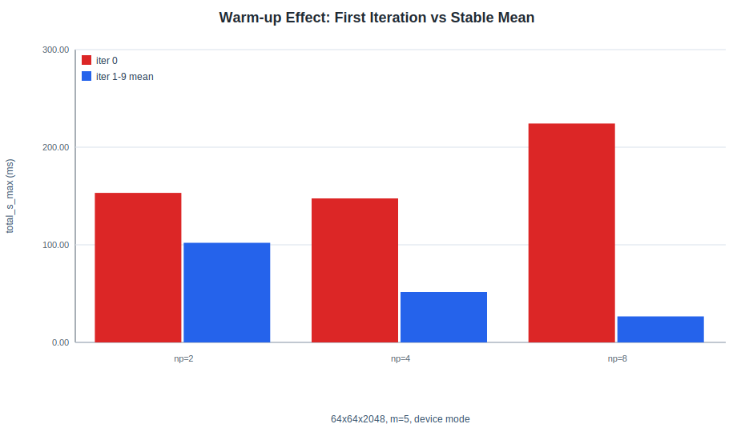

# CUDA C++ Port Study of a Non-Cyclic MPI-Parallel BTDMA Solver

## Summary

This study evaluates the CUDA C++ port of the non-cyclic PaScaL_BTDMA GPU solver on a single 8-GPU H200 node. The purpose is to document the porting result as an engineering artifact: the solver can be launched through reproducible Study scripts, it records phase-level timing, and it exposes the performance behavior of block size, batch size, local row length, and CUDA-aware MPI mode.

The current dataset contains CUDA C++ timing rows only. The case matrix requested CUDA Fortran original rows as well, but the actual server run did not collect `fortran-original` timing. Therefore, this report does not claim a Fortran-vs-C++ performance comparison. It reports the CUDA C++ port behavior and keeps the original Fortran comparison as the next validation step.

Key findings:

- The collected dataset has `310` timing rows, covering `31` CUDA C++ implementation cases with `m = 2, 3, 5, 8`, `np = 1, 2, 4, 8`, and both device and host MPI modes where requested.
- For the central non-cyclic case `64x64x2048`, `m=5`, CUDA-aware device-mode time improves from `102.064 ms` at 2 GPUs to `26.627 ms` at 8 GPUs.
- Strong scaling from the 2-GPU baseline reaches `3.833x` speedup and `95.8%` efficiency at 8 GPUs for the central `m=5` case.
- Across `m = 2, 3, 5, 8`, 8-GPU strong-scaling efficiency remains high: `95.6%`, `95.8%`, `95.8%`, and `97.8%`, respectively.
- Weak-nrow scaling with fixed local `nrow=512` remains nearly flat from 2 to 8 GPUs: 8-GPU weak efficiencies are `95.9%`, `98.2%`, and `97.6%` for `m = 2, 5, 8`.
- CUDA-aware device mode reduces measured communication time versus host fallback. For the central `m=5` case, host fallback is `1.010x`, `1.015x`, and `1.051x` slower at 2, 4, and 8 GPUs.
- The first iteration has a visible warm-up cost, especially at higher GPU counts, so all timing conclusions use iterations `1-9`.

## Project Context

PaScaL_BTDMA solves many independent block tridiagonal systems on distributed GPUs. Compared with scalar TDMA, the important additional axis is the block size `m`. The communication payload for the boundary-row exchange scales with `m^2 nsys`, where `nsys = n1*n2`, while the local block work scales roughly with `m^3` per row.

The manuscript context in `Manuscript_v6.pdf` frames the production algorithm around:

- a boundary-row communication pattern whose communication volume scales as `m^2 nsys` and does not grow with the global row length `N`;
- a GPU memory layout with the batch/system index leading, equivalent to `(nsys, Nsub, m, m)` for block matrices;
- performance questions around strong scaling, weak scaling, block size, batch size, and local row length on H200-class GPUs.

This report uses those ideas as the interpretation frame, but the current Study data is narrower: it covers the CUDA C++ non-cyclic port only, without cyclic BTDMA, CPU baseline, or all-to-all baseline comparisons.

## Repository Artifacts

- CUDA C++ profile example: `Study/example_cuda_cxx_btdma_profile.cu`
- Fortran profile example: `Study/example_fortran_btdma_profile.f90`
- Study runner: `Study/run_study_sweep.sh`
- Full case-matrix runner: `Study/run_full_study.sh`
- Case matrix: `Study/result/btdma_report_case_matrix.csv`
- Analysis script: `Study/result/analyze_btdma_study_results.py`
- Timing data: `Study/result/btdma_total_profile_260702_193138.csv`
- Solution signature data: `Study/result/btdma_solution_signature_260702_193138.csv`
- Environment capture: `Study/result/btdma_environment_260702_193138.txt`
- Report tables: `Study/result/tables/`
- Report figures: `Study/result/figures/`

## Test Environment

| Item | Value |
| --- | --- |
| Date | 2026-07-02 19:31:38 +0900 |
| Host | `gpu56` |
| GPU | 8 x NVIDIA H200 |
| Driver | 580.105.08 |
| CUDA shown by driver | 13.0 |
| CUDA compiler | CUDA 12.9, `nvcc` V12.9.86 |
| MPI | Open MPI 4.1.9a1 |
| C++ compiler wrapper | `mpicxx` with `nvc++` 25.11 |
| Fortran compiler wrapper | `mpifort` with `nvfortran` 25.11 |
| Iterations per case | 10 |
| Timing statistics | iterations `1-9` |

The full environment capture is preserved in `Study/result/btdma_environment_260702_193138.txt`.

## Data Coverage

| item | value |
| --- | --- |
| profile rows | 310 |
| profile cases | 31 |
| signature rows | 31 |
| case matrix rows | 31 |
| expected implementation cases | 59 |
| observed implementation cases | 31 |
| missing expected implementation cases | 28 |
| implementations in profile | cuda-cxx |
| MPI modes in profile | device, host |
| block sizes m | 2, 3, 5, 8 |
| rank counts | 1, 2, 4, 8 |
| Fortran timing rows present | no |

Full table: [result/tables/0_data_coverage.md](result/tables/0_data_coverage.md)

The missing expected rows are all `fortran-original` runs. The dry-run log showed both CUDA C++ and Fortran commands, but the real run log contains only CUDA C++ execution rows. This was traced to the common shell pattern where `mpirun` can consume the loop's standard input. The runner has been updated so future `mpirun` calls use `/dev/null` as stdin, but the current report remains limited to the already collected CUDA C++ dataset.

Missing-run table: [result/tables/10_expected_vs_observed_runs.md](result/tables/10_expected_vs_observed_runs.md)

## Metrics

The primary timing metric is `total_s_max`, the maximum elapsed solver time across MPI ranks. This is the appropriate wall-time metric for synchronous multi-rank execution.

Additional metrics:

- `compute_s_max`: local block solve, reduced block solve, and update phases
- `communication_s_max`: forward and backward exchange phases
- `throughput_Mcells_s = n1*n2*n3 / total_s_max`
- `work_Gunits_s = nsys*n3*m^3 / total_s_max / 1e9`
- strong-scaling speedup from 2-GPU baseline: `T2/Tp`
- strong-scaling efficiency from 2-GPU baseline: `T2 / ((p/2) Tp)`
- weak-nrow efficiency: `T2/Tp` when local `nrow` is fixed

For BTDMA, `work_Gunits_s` is more informative than plain cell throughput when comparing across `m`, because block operations grow approximately with `m^3`.

## Solution Signatures

The Study driver records solution signatures from the first solve: global sum, L2 norm, Linf norm, and representative samples. These signatures are not a manufactured-solution correctness proof, but they are useful for confirming that the CUDA C++ port is producing stable first-solve outputs across decomposition and MPI-mode variants.

Across the common `64x64x2048` device-mode cases, the signature variation across `np = 2, 4, 8` is small. For example, at `m=5`, the global solution-sum range is `9.136e-03` over a total sum of about `1.678e+07`, and the representative midpoint sample remains `0.400000`.

Full table: [result/tables/1_signature_summary.md](result/tables/1_signature_summary.md)

## Central Case Timing

The central case for this report is:

```text
n1=64, n2=64, n3=2048, m=5
```

It is used for strong-scaling, phase-breakdown, MPI-mode, and warm-up discussion.

| implementation | mode | np | total_ms | local_ms | forward_ms | reduced_ms | backward_ms | update_ms | Mcells_s | work_Gunits_s |
| --- | --- | --- | --- | --- | --- | --- | --- | --- | --- | --- |
| cuda-cxx | device | 2 | 102.064 | 85.991 | 0.575 | 0.144 | 0.039 | 15.491 | 82.2 | 10.27 |
| cuda-cxx | device | 4 | 51.615 | 42.969 | 0.655 | 0.291 | 0.074 | 7.775 | 162.5 | 20.32 |
| cuda-cxx | device | 8 | 26.627 | 21.324 | 0.894 | 0.570 | 0.122 | 3.823 | 315.0 | 39.38 |
| cuda-cxx | host | 2 | 103.047 | 86.158 | 1.420 | 0.144 | 0.110 | 15.491 | 81.4 | 10.18 |
| cuda-cxx | host | 4 | 52.391 | 42.873 | 1.444 | 0.291 | 0.139 | 7.773 | 160.1 | 20.01 |
| cuda-cxx | host | 8 | 27.998 | 21.340 | 2.139 | 0.570 | 0.225 | 3.826 | 299.6 | 37.45 |

Full table: [result/tables/2_central_case_timing.md](result/tables/2_central_case_timing.md)



The local block computation dominates total time. Communication becomes more visible as the rank count rises, but it is still a small fraction of total time for this central case: `0.60%`, `1.40%`, and `3.79%` at 2, 4, and 8 GPUs in device mode.

## Strong Scaling

Strong scaling uses the fixed global grid `64x64x2048` and compares `np = 2, 4, 8`.

| m | np | total_ms | speedup_2base | efficiency_percent | work_Gunits_s | comm_percent |
| --- | --- | --- | --- | --- | --- | --- |
| 2 | 2 | 22.853 | 1.000 | 100.0 | 2.94 | 0.89 |
| 2 | 4 | 11.459 | 1.994 | 99.7 | 5.86 | 3.18 |
| 2 | 8 | 5.975 | 3.825 | 95.6 | 11.23 | 9.59 |
| 3 | 2 | 41.815 | 1.000 | 100.0 | 5.42 | 0.75 |
| 3 | 4 | 21.138 | 1.978 | 98.9 | 10.72 | 1.90 |
| 3 | 8 | 10.915 | 3.831 | 95.8 | 20.75 | 6.09 |
| 5 | 2 | 102.064 | 1.000 | 100.0 | 10.27 | 0.60 |
| 5 | 4 | 51.615 | 1.977 | 98.9 | 20.32 | 1.40 |
| 5 | 8 | 26.627 | 3.833 | 95.8 | 39.38 | 3.79 |
| 8 | 2 | 240.938 | 1.000 | 100.0 | 17.83 | 0.63 |
| 8 | 4 | 120.936 | 1.992 | 99.6 | 35.51 | 2.45 |
| 8 | 8 | 61.586 | 3.912 | 97.8 | 69.74 | 3.21 |

Full table: [result/tables/3_strong_scaling.md](result/tables/3_strong_scaling.md)





The strong-scaling line plots use log-log axes. Solid lines show measured values, dashed lines show ideal scaling from the 2-GPU baseline, and point labels show measured parallel efficiency.

The port scales cleanly from 2 to 8 GPUs for all tested block sizes. The larger `m=8` case has the highest work-weighted throughput and the best 8-GPU efficiency in this matrix, because the larger block computation gives each rank more useful work relative to orchestration and exchange cost.

## Block-Size Sensitivity

At fixed `64x64x2048`, total time increases with block size, as expected from the cubic block work. The work-weighted throughput also rises with `m`, which indicates better GPU utilization for larger per-system block work in this test matrix.

| np | m | m2_nsys_payload | total_ms | compute_ms | comm_ms | work_Gunits_s |
| --- | --- | --- | --- | --- | --- | --- |
| 2 | 2 | 16384 | 22.853 | 22.654 | 0.203 | 2.94 |
| 2 | 5 | 102400 | 102.064 | 101.613 | 0.613 | 10.27 |
| 2 | 8 | 262144 | 240.938 | 240.153 | 1.517 | 17.83 |
| 8 | 2 | 16384 | 5.975 | 5.408 | 0.573 | 11.23 |
| 8 | 5 | 102400 | 26.627 | 25.706 | 1.010 | 39.38 |
| 8 | 8 | 262144 | 61.586 | 59.927 | 1.977 | 69.74 |

Full table: [result/tables/5_m_sensitivity.md](result/tables/5_m_sensitivity.md)



The communication payload column follows `m^2 nsys`. It grows from `16,384` at `m=2` to `262,144` at `m=8` for the same `nsys=4096`, but communication remains a modest fraction of total time because local block computation grows quickly with `m`.

## Nsys Sensitivity

`nsys = n1*n2` controls the number of independent BTDMA systems. At `np=8` and `n3=2048`, increasing `nsys` substantially improves work-weighted throughput.

| m | nsys | grid | m2_nsys_payload | total_ms | Mcells_s | work_Gunits_s |
| --- | --- | --- | --- | --- | --- | --- |
| 2 | 1024 | 32x32x2048 | 4096 | 4.811 | 435.9 | 3.49 |
| 2 | 4096 | 64x64x2048 | 16384 | 5.975 | 1404.0 | 11.23 |
| 2 | 16384 | 128x128x2048 | 65536 | 6.579 | 5100.1 | 40.80 |
| 5 | 1024 | 32x32x2048 | 25600 | 25.615 | 81.9 | 10.23 |
| 5 | 4096 | 64x64x2048 | 102400 | 26.627 | 315.0 | 39.38 |
| 5 | 16384 | 128x128x2048 | 409600 | 29.902 | 1122.1 | 140.27 |
| 8 | 1024 | 32x32x2048 | 65536 | 60.435 | 34.7 | 17.77 |
| 8 | 4096 | 64x64x2048 | 262144 | 61.586 | 136.2 | 69.74 |
| 8 | 16384 | 128x128x2048 | 1048576 | 84.719 | 396.1 | 202.79 |

Full table: [result/tables/6_nsys_sensitivity.md](result/tables/6_nsys_sensitivity.md)



The total runtime changes much more slowly than the total amount of work. For `m=5`, increasing `nsys` from `1024` to `16384` increases work by `16x`, while total time rises only from `25.615 ms` to `29.902 ms`. This is the expected GPU batching effect: more independent systems expose more parallelism.

## Weak-Nrow Scaling

Weak-nrow scaling keeps local `nrow = n3/np` fixed at `512` and increases total problem size with the number of GPUs.

| m | np | grid | local_nrow | total_ms | weak_efficiency_percent | work_Gunits_s |
| --- | --- | --- | --- | --- | --- | --- |
| 2 | 2 | 64x64x1024 | 512 | 11.293 | 100.0 | 2.97 |
| 2 | 4 | 64x64x2048 | 512 | 11.459 | 98.5 | 5.86 |
| 2 | 8 | 64x64x4096 | 512 | 11.781 | 95.9 | 11.39 |
| 5 | 2 | 64x64x1024 | 512 | 51.225 | 100.0 | 10.23 |
| 5 | 4 | 64x64x2048 | 512 | 51.615 | 99.2 | 20.32 |
| 5 | 8 | 64x64x4096 | 512 | 52.148 | 98.2 | 40.22 |
| 8 | 2 | 64x64x1024 | 512 | 119.481 | 100.0 | 17.97 |
| 8 | 4 | 64x64x2048 | 512 | 120.936 | 98.8 | 35.51 |
| 8 | 8 | 64x64x4096 | 512 | 122.395 | 97.6 | 70.18 |

Full table: [result/tables/7_weak_nrow_scaling.md](result/tables/7_weak_nrow_scaling.md)



The weak-nrow line plot also uses log-log axes. Dashed lines mark ideal constant-time weak scaling from the 2-GPU baseline, and point labels show weak-scaling efficiency.

The weak-nrow result is one of the cleanest results in the dataset. Runtime remains nearly flat while total work increases with rank count, especially for `m=5` and `m=8`.

## MPI Device Mode vs Host Fallback

The CUDA C++ port supports CUDA-aware MPI device-buffer communication by default, with host staging available through `PASCAL_BTDMA_MPI_MODE=host`.

| np | mode | total_ms | compute_ms | comm_ms | comm_percent | host_over_device |
| --- | --- | --- | --- | --- | --- | --- |
| 2 | device | 102.064 | 101.613 | 0.613 | 0.60 | - |
| 2 | host | 103.047 | 101.793 | 1.530 | 1.48 | 1.010 |
| 4 | device | 51.615 | 51.033 | 0.724 | 1.40 | - |
| 4 | host | 52.391 | 50.933 | 1.579 | 3.01 | 1.015 |
| 8 | device | 26.627 | 25.706 | 1.010 | 3.79 | - |
| 8 | host | 27.998 | 25.722 | 2.352 | 8.40 | 1.051 |

Full table: [result/tables/8_mpi_mode_comparison.md](result/tables/8_mpi_mode_comparison.md)



Host staging roughly doubles the measured communication time in the central case, but total-time impact is smaller because compute dominates. The gap is largest at 8 GPUs, where host fallback is `5.1%` slower overall.

## Reproducibility And Warm-Up

The first iteration should not be used for steady-state timing. For the central `m=5` device-mode case, the first iteration is `1.5x`, `2.9x`, and `8.4x` slower than the stable mean at 2, 4, and 8 GPUs.

| np | iter0_ms | iter1_9_mean_ms | iter0_over_stable | stable_cv_percent |
| --- | --- | --- | --- | --- |
| 2 | 153.175 | 102.064 | 1.5 | 0.10 |
| 4 | 147.538 | 51.615 | 2.9 | 0.08 |
| 8 | 224.297 | 26.627 | 8.4 | 0.07 |

Full table: [result/tables/9_warmup_effect.md](result/tables/9_warmup_effect.md)



The stable iterations have low coefficient of variation in the central case, below `0.10%`, which makes iterations `1-9` a reasonable basis for this report.

## Current Limitations

This report is intentionally limited to what the current result files support.

- No Fortran-vs-C++ timing comparison is claimed because the actual timing CSV has no `fortran-original` rows.
- No manufactured-solution correctness proof is claimed. The signature CSV is a consistency artifact, not a full numerical validation.
- Only non-cyclic BTDMA is covered. The CUDA C++ port does not yet implement the cyclic BTDMA path.
- No CPU baseline or conventional all-to-all baseline is included.
- The measurements are single-node H200 results. Multi-node communication behavior remains outside this dataset.

## Next Steps

1. Re-run the same case matrix after the `mpirun` stdin fix so that `fortran-original` rows are collected.
2. Add a direct Fortran-vs-C++ table for total time and phase timing on the central, strong-scaling, nsys, nrow, and MPI-mode cases.
3. Add an explicit correctness comparison between CUDA C++ and CUDA Fortran signatures for every shared case.
4. Keep cyclic BTDMA explicitly out of scope until the CUDA C++ cyclic solver exists.
5. If the report needs to align more directly with the manuscript, add all-to-all and/or CPU baseline data as separate comparison groups instead of mixing them into this non-cyclic port validation.

## Conclusion

The CUDA C++ non-cyclic BTDMA port produces a reproducible performance dataset with meaningful phase-level timing. The current results show strong scaling from 2 to 8 H200 GPUs, high weak-nrow efficiency, predictable block-size sensitivity, and measurable benefit from CUDA-aware device MPI communication.

As a porting artifact, the value of this Study is not only the raw speed. It demonstrates a clean CUDA C++ benchmark path for a Fortran CUDA/MPI solver, exposes the key BTDMA performance axes, and makes current validation limits explicit enough that the next Fortran comparison can be added without rewriting the analysis workflow.
